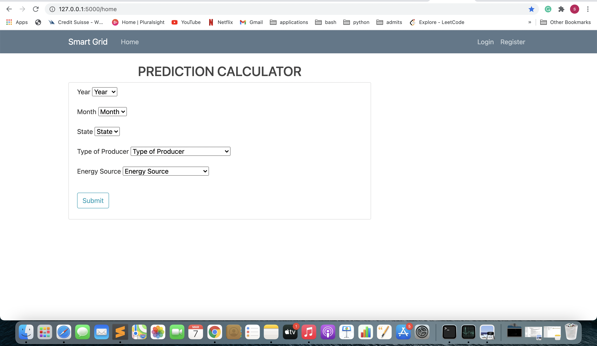
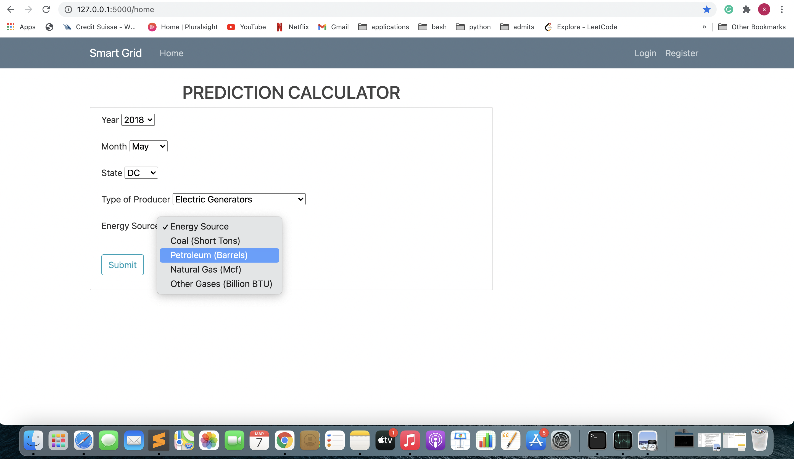
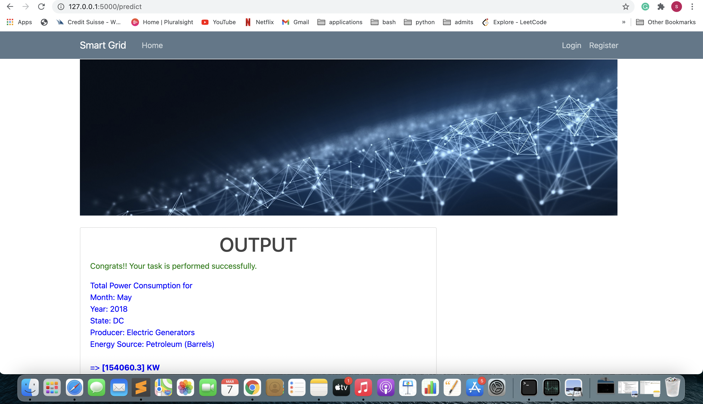

# Smart-Grid
The Smart Grid will be the power grid of the future. It will offer a two way communication flow, between consumers and providers, to ensure energy is distributed in the most efficient way. With the advance of the internet and technology in general, we have the ability to improve the traditional power grid and turn it into an intelligent, automated and distributed energy delivery network that will be able to assess the state of the grid in real time and adopt an appropriate mode of operation. "A key component of an efficient Smart Grid operation will be the accurate prediction of future supply and demand trends."

Table of content
* Images = Screenshot of web app
* Static = Images used in web
* Templates = HTML files
* Training = Random Forrest Model Training
* Model = Model deployment using flask

